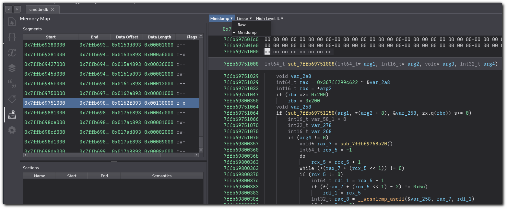

# Binary Ninja Minidump Loader

A Minidump loader plugin for Binary Ninja.



## Supported Minidump Types

This plugin currently only supports loading minidump files generated by the Windows [`MiniDumpWriteDump` API](https://learn.microsoft.com/en-us/windows/win32/api/minidumpapiset/nf-minidumpapiset-minidumpwritedump).

Minidump files from other platforms, such as those generated by [Google Breakpad](https://chromium.googlesource.com/breakpad/breakpad/), are currently not supported.

## Building and Installing

This plugin currently needs to be built from source, then copied into your user plugin folder.

```
cargo build --release
cp target/release/libminidump_bn.so ~/.binaryninja/plugins/
```

The code in this plugin targets the `dev` branch of the [Binary Ninja Rust API](https://github.com/Vector35/binaryninja-api/tree/dev/rust).
